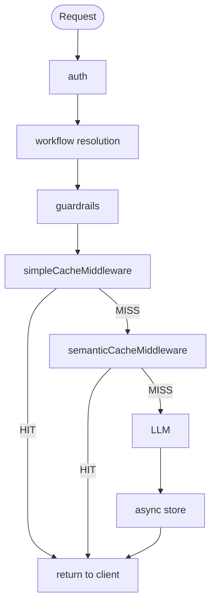

# ADR-0006: Semantic Response Cache

## Status

Accepted

## Context

GoModel already has an exact-match response cache (`simpleCacheMiddleware`) that hashes the full request body and returns a stored response on byte-identical requests. This covers trivial cases but misses semantically equivalent requests with different phrasing:

- "What's the capital of France?" vs. "Which city is France's capital?"
- "Explain quantum entanglement simply" vs. "ELI5 quantum entanglement"

Production benchmarks from similar systems show exact-match hit rates ~18%, while semantic caching reaches ~60–70% in high-repetition workloads - a significant reduction in LLM API costs and latency.

A second-layer semantic cache is needed to recognize meaning-equivalent queries without upstream LLM calls.

## Decision

### Layer Position & Ordering

Semantic caching runs as a **second layer behind exact-match caching**.
Exact-match (sub-ms) always runs first; semantic (~50–100 ms including embedding) only on miss.

**Important**: both cache layers must execute **after** guardrail/Workflow patching, so they see the final prompt sent to the LLM.
Current global middleware placement runs too early and can bypass guardrails - this is fixed by moving cache checks into the translated inference handlers (post-`PatchChatRequest`).

Exact layer: `simpleCacheMiddleware` (byte-identical body, SHA-256). Semantic layer: `semanticCacheMiddleware` (vector KNN). On exact **HIT**, respond with `X-Cache: HIT (exact)`; on semantic **HIT**, `X-Cache: HIT (semantic)`. On full miss, the handler forwards to the LLM, stores exact + semantic entries, then returns.

### Embedding

Unified `Embedder` interface with a single implementation: an **HTTP client** calls the OpenAI-compatible **`…/v1/embeddings`** endpoint derived from the selected provider entry’s resolved **`base_url`** (same join rule as `llmclient`: base URL plus `/embeddings` when the base already ends with `/v1`, otherwise `/v1/embeddings`).

- **`embedder.provider`** must be set to a **key** in the top-level `providers:` map (e.g. `gemini`, `openai`, or a custom key when multiple backends share a type). There is **no default** provider and no in-process/local embedder.
- At startup, the semantic layer receives **`CredentialResolvedProviders`** from `providers.Init` - the same **env-merged, credential-filtered** map used for routing - so YAML-only vs env-only credentials behave consistently with the rest of the gateway.

### Vector Store

`VecStore` interface + `type`-switched factory in [`internal/responsecache/vecstore.go`](https://github.com/ENTERPILOT/GoModel/blob/main/internal/responsecache/vecstore.go). When semantic caching is enabled, **`vector_store.type` is required** (no default). Supported values:

| Type       | Notes                                                                                                                                                                                                                     |
| ---------- | ------------------------------------------------------------------------------------------------------------------------------------------------------------------------------------------------------------------------- |
| `qdrant`   | HTTP API; `url`, `collection`, optional `api_key`. Collection is created on first insert (vector size from embedding, **Cosine** distance).                                                                               |
| `pgvector` | PostgreSQL + `pgvector`; `url`, required `dimension` for `vector(n)`, optional `table` (default `gomodel_semantic_cache`).                                                                                                |
| `pinecone` | Data-plane HTTP (`host`, `api_key`, required `dimension`, optional `namespace`). Full response body is stored in metadata (base64); **Pinecone metadata limits** (~40KB per value) can reject very large cached payloads. |
| `weaviate` | HTTP GraphQL + REST; `url`, `class` (GraphQL-safe, **PascalCase**), optional `api_key`. Class is auto-created with `vectorizer: none` if missing.                                                                         |

TTL is implemented via `expires_at` (unix seconds, `0` = no expiry) plus read-time filtering and a **background `DeleteExpired` tick** (~1 hour).

### Text Extraction

- Embed the **last user message** (GPTCache-style default - pragmatic hit-rate/accuracy trade-off).
- If `exclude_system_prompt: true`, strip system messages before count & embedding (avoids noise from identical system prompts).
- Full conversation embedding rejected (noisy vectors, poor scaling on long threads).

### Parameter Isolation (`params_hash`)

SHA-256 of output-shaping parameters including `model`, `temperature`, `top_p`, `max_tokens`, `tools` (xxhash64 per tool, then SHA-256 of combined seed), `response_format`, `stream`, `endpointPath` (the raw URL path, for endpoint safety), and `guardrails_hash`.
All KNN searches filter by this hash → prevents serving wrong-format / wrong-parameter / wrong-policy responses.

`guardrails_hash` is a SHA-256 of all active guardrail rule names, types, and content (sorted for stability, with xxhash64 used per-component for speed). It is computed once at startup in `app.go` from `config.GuardrailsConfig`, stored in the Echo context under `core.guardrailsHashKey` (via `core.WithGuardrailsHash`) immediately after `PatchChatRequest`, and read by `semanticCacheMiddleware` when building `params_hash`. When guardrail policy changes, the hash changes and old cache entries become unreachable - no manual cache flush needed. Entries expire naturally via TTL.

### Conversation History Threshold

Skip semantic caching when non-system messages > `max_conversation_messages` (default: 3).
Long multi-turn sessions have near-zero hit rates and high false-positive risk. Exact-match still applies.

### Similarity Threshold

**Default: 0.92** (0.90–0.95 consensus range).
Start here; tune down only after monitoring false positives (higher = safer, lower = more hits).
Bifrost's 0.80 is too aggressive for correctness-sensitive use cases.

### Per-Request Overrides

- `X-Cache-Semantic-Threshold`
- `X-Cache-TTL`
- `X-Cache-Type`: `exact` | `semantic` | `both` (default)
- `X-Cache-Control: no-store`

### What is Explicitly Not Implemented (v1)

- Streaming caching (skipped entirely - phase-2: chunk array storage + replay)
- Cross-endpoint normalization (`/chat/completions` vs `/responses` vs pass-through) - `endpointPath` in `params_hash` for safety → Future optimization: canonical response renderer to enable sharing
- `cache_by_model` / `cache_by_provider` opt-out flags - both layers always include `model` and provider identity in their cache keys (`params_hash` for semantic, `SHA-256(path + Workflow + body)` for exact). Disabling either safely requires shared flag semantics across both layers; deferred to a future `ResponseCacheConfig`-level enhancement
- Cache warming, manual purge, advanced eviction
- Prometheus metrics / observability (deferred - basic structured logging sufficient for v1)

## Consequences

### Positive

- Expected 60–70% semantic hit rates in support/FAQ/classification workloads
- Strong correctness guarantees via parameter isolation & high threshold
- Reuses existing provider credentials for embeddings via the same resolved provider map as routing
- Swappable vector backends (`qdrant`, `pgvector`, `pinecone`, `weaviate`) behind `VecStore`

### Negative / Mitigations

- ~50–100 ms added latency on semantic miss (acceptable vs LLM latency)
- Requires a provider with a working OpenAI-compatible embeddings endpoint and credentials
- Semantic layer **requires external vector infrastructure** (no embedded sqlite-vec path)
- Pinecone metadata size caps can block caching very large JSON bodies - mitigated by clear errors / operational choice of backend
- False positives possible → mitigated by high default threshold + sampling of semantic hits
- No benefit for creative, real-time, or personalized traffic → use `no-store` header
- No observability yet → add structured logs for semantic hits/misses in v1

## Alternatives Considered

- **Embedded default vector store (sqlite-vec)** - removed to reduce CGO/sqlite-vec complexity and keep one operational model: explicit choice of managed/self-hosted vector DB.
- Redis/RediSearch as a backend - not chosen for v1; Qdrant/pgvector/Pinecone/Weaviate cover common deployment patterns.
- Embed full conversation → rejected (noisy, expensive, low hit rate)
- Single cache store for exact + semantic → rejected (different needs & scaling)
- Optional in-process embedder (e.g. ONNX MiniLM) → removed; API-only embedding keeps one code path and avoids native runtime dependencies
