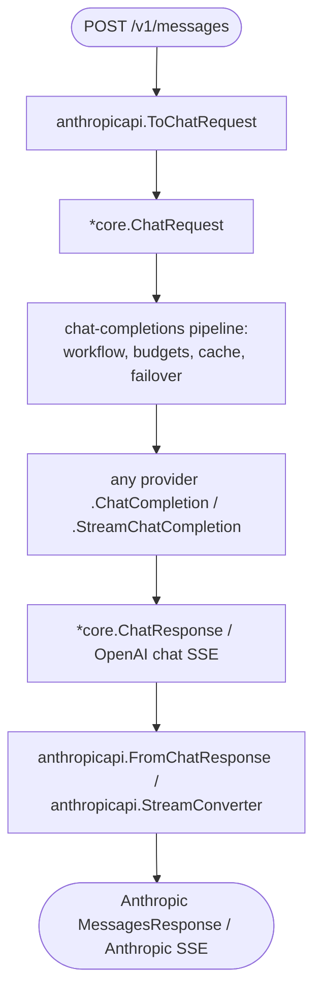

# ADR-0007: Anthropic Messages API Ingress

## Status

Accepted

## Context

GoModel exposes an OpenAI-compatible public API (`/v1/chat/completions`, `/v1/responses`,
`/v1/embeddings`). A growing number of clients and SDKs speak the **Anthropic Messages API**
dialect (`POST /v1/messages`) instead. Today those clients can only reach GoModel through the
opaque passthrough route `/p/anthropic/v1/messages`, which:

- forwards bytes verbatim to the Anthropic upstream only — it cannot route to OpenAI, Gemini,
  Bedrock, or any other provider;
- bypasses managed features: model aliases, workflow policy, budgets, failover, and the
  exact/semantic response cache.

We want a **managed** `/v1/messages` endpoint that accepts the Anthropic request dialect but
can route to **any** configured provider, with the same cost tracking and audit logging as the
OpenAI-compatible routes.

The existing `/v1/responses` endpoint already solved the structurally identical problem — a
non-chat-completions dialect that is translated into the canonical chat type and run through the
shared pipeline. ADR-0002 (ingress frame and semantic envelope) established that dialect
translation belongs at the ingress boundary.

## Decision

### Translate at the ingress boundary; keep the gateway canonical

`POST /v1/messages` is implemented as a thin ingress dialect. The Anthropic request is
translated **once, centrally** into the canonical `core.ChatRequest`, then run through the
**unchanged** chat-completions pipeline (workflow resolution, model authorization, budgets,
failover, response cache, provider dispatch). The provider's `core.ChatResponse` (or its
OpenAI-style SSE stream) is translated back into the Anthropic Messages shape just before the
response is written to the client.



Because every provider already implements `ChatCompletion`/`StreamChatCompletion`, the endpoint
works for **all providers** with no provider-specific code. There are **no changes** to
`internal/gateway`, `internal/providers`, `internal/usage`, or `internal/auditlog`.

### Package layout

A new, isolated package `internal/anthropicapi` owns the dialect and depends only on
`internal/core`. It deliberately does **not** depend on the `anthropic` *provider* package:
provider egress (talking to the Anthropic upstream) and ingress dialect translation (accepting
the Anthropic wire format from clients) are different concerns and translate in opposite
directions.

| File | Responsibility |
| ---- | -------------- |
| `types.go`    | Anthropic Messages wire DTOs (request, response, content blocks, SSE events, error) |
| `request.go`  | `DecodeMessagesRequest`, `ToChatRequest`, `EstimateInputTokens` |
| `response.go` | `FromChatResponse` |
| `stream.go`   | `StreamConverter` — wraps an OpenAI-style chat SSE stream, emits Anthropic SSE events |
| `errors.go`   | `ErrorFromGateway` — `core.GatewayError` → Anthropic error envelope |

The HTTP glue lives in `internal/server/messages_handler.go`; `POST /v1/messages` and
`POST /v1/messages/count_tokens` are registered in `http.go` and classified in
`core/endpoints.go` (Dialect `anthropic`, Operation `chat_completions`).

### Cost tracking and audit logging come for free

Audit logging is an HTTP middleware that wraps every route, so `/v1/messages` is audited
automatically. Usage and cost are extracted from the canonical `core.ChatResponse` and priced
by the **actual** provider that served the request, so they work without changes.

For streaming, the observer ordering is the key decision:

```text
provider chat SSE
  → ObservedSSEStream(audit + usage observers)   # observers see canonical OpenAI chat chunks
    → anthropicapi.StreamConverter               # outermost: chat SSE → Anthropic SSE
      → HTTP response
```

The audit and usage observers wrap the **inner** canonical stream — the format they already
parse — and the Anthropic converter is the **outermost** layer applied last. This is the
opposite ordering from `/v1/responses` (which wraps the converter first and required the audit
observer to learn a Responses-specific code path); the inner-observer ordering means audit and
usage need no Anthropic-specific knowledge. `stream_options.include_usage` is set on the
translated request so the provider emits the final usage chunk.

### count_tokens is a heuristic estimate

`POST /v1/messages/count_tokens` returns `{"input_tokens": N}` using a provider-agnostic
character-based heuristic (`≈ characters / 4`) over all request text. No upstream provider has
a portable cross-provider token-counting endpoint, and adding one would require a new provider
interface method. The heuristic keeps the endpoint dependency-free, deterministic, and
universal. It is an **approximation**, not a tokenizer-exact count — see Consequences.

### Errors

All `/v1/messages` and `/v1/messages/count_tokens` failures are returned in the Anthropic error
envelope (`{"type": "error", "error": {"type": ..., "message": ...}}`), with `core.ErrorType`
mapped to the nearest Anthropic error type. This keeps the endpoint faithfully Anthropic-compatible
end to end, including request-validation and upstream errors.

### What is explicitly not implemented (v1)

- **`/v1/messages/batches`** (Messages Batches API) — deferred; batches has its own pipeline.
- **`cache_control` breakpoints** — dropped during the canonical hop; prompt-caching cost
  benefits are not preserved when translating through `core.ChatRequest`.
- **Extended-thinking signatures and `thinking` blocks on input messages** — dropped; the
  canonical chat type has no first-class field for them.
- **Server/built-in tools** (web search, code execution, etc.) — a `tools[]` entry
  with a versioned `type` (e.g. `web_search_20250305`) is **rejected with a clear
  `400`** rather than mistranslated into a phantom custom function the gateway cannot
  execute. Only custom tools (`type` absent or `"custom"`) translate.
- **`top_k`** — dropped. It is not a valid OpenAI Chat Completions parameter, and the
  OpenAI-family providers forward request fields verbatim and reject unknown ones with
  a `400`; carrying it would make any `top_k` request fail when routed to those
  providers. `temperature` and `top_p` are portable and are carried.
- **`document` and other non-text/image content blocks** — these carry caller payload
  with no canonical chat equivalent, so they are rejected with a clear `400` error
  rather than silently dropped (which would make the model answer as if the attachment
  were never sent). `thinking`/`redacted_thinking` blocks are the exception: they are
  assistant-side artifacts and are dropped silently.

## Consequences

### Positive

- One managed Anthropic-dialect endpoint that routes to **every** configured provider.
- Model aliases, workflow policy, budgets, failover, and the response cache apply unchanged.
- Cost tracking and audit logging work with **zero** changes to `usage`/`auditlog`.
- No changes to `gateway` or `providers`; ~5 small files plus thin HTTP glue.
- Translation is centralized and dialect-isolated; a future dialect (e.g. Gemini-native
  ingress) can follow the same shape.

### Negative / Mitigations

- **Lossy round-trip to the Anthropic provider.** A `/v1/messages` request routed *to* the
  Anthropic provider is translated Anthropic → `core.ChatRequest` → Anthropic; provider-only
  features (`cache_control`, thinking signatures, server tools) do not survive the canonical
  hop. Mitigation: clients needing byte-exact Anthropic fidelity (including prompt-cache
  breakpoints) can still use the `/p/anthropic/v1/messages` passthrough. A future optimization
  could add an Anthropic → Anthropic fast path that skips the canonical hop.
- **count_tokens is an estimate**, typically within ~10–25% of a tokenizer-exact count, and is
  not model-specific. Mitigation: documented clearly; adequate for budgeting/UX sizing, not for
  hard context-limit decisions.
- **`stop_reason` fidelity for stop sequences.** `stop_sequences` are honored end to end (the
  OpenAI `stop` field is mapped to Anthropic `stop_sequences`). The canonical chat type keeps the
  conservative OpenAI `finish_reason` but carries a natively-reported matched sequence as a
  `stop_sequence` choice extension (same spirit as the relayed `reasoning_content`), so requests
  served by the Anthropic provider report the full `stop_reason: "stop_sequence"` contract.
  OpenAI-family providers conflate stop-parameter hits with natural stops in `finish_reason`, so
  completions there still report `stop_reason: "end_turn"`; the output is truncated correctly,
  only the reason label differs.
- Anthropic-specific request features routed to non-Anthropic providers degrade gracefully
  (dropped or approximated), consistent with Postel's law.
- Streaming audit reconstructs the response body in OpenAI chat shape (the observer sees the
  canonical inner stream), while non-streaming stores the Anthropic body. This streaming /
  non-streaming asymmetry already exists for `/v1/responses` and is accepted.

## Alternatives Considered

- **Per-provider `Messages()` interface method** (mirroring `Responses()`) — rejected: it would
  require touching every provider and a new `core.Provider` method, for no behavioral gain over
  central translation. The Responses API needed per-provider hooks for native Responses
  endpoints; the Messages dialect has no such requirement.
- **Reusing the `anthropic` provider's wire types** (`anthropicRequest`, etc.) — rejected: they
  are unexported and coupled to upstream egress. Ingress translation is a distinct layer; a
  small amount of DTO duplication is cleaner than a cross-layer dependency.
- **Anthropic → Anthropic passthrough fast path in v1** — deferred: correct, but adds a second
  code path; the lossy round-trip is an acceptable, documented v1 tradeoff.
- **Provider-backed count_tokens** (call Anthropic's native count endpoint) — rejected for v1:
  only one provider has such an endpoint, so it cannot be universal without a new interface.
